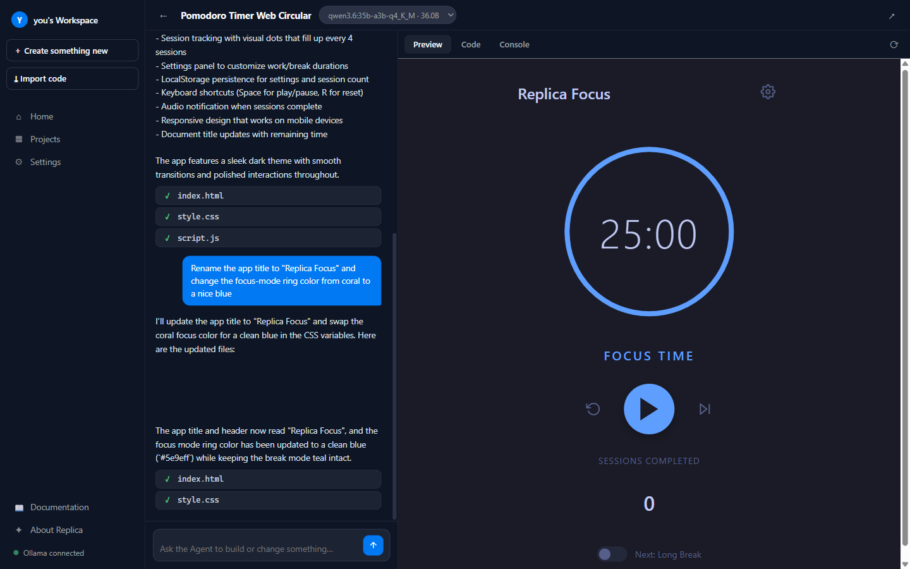
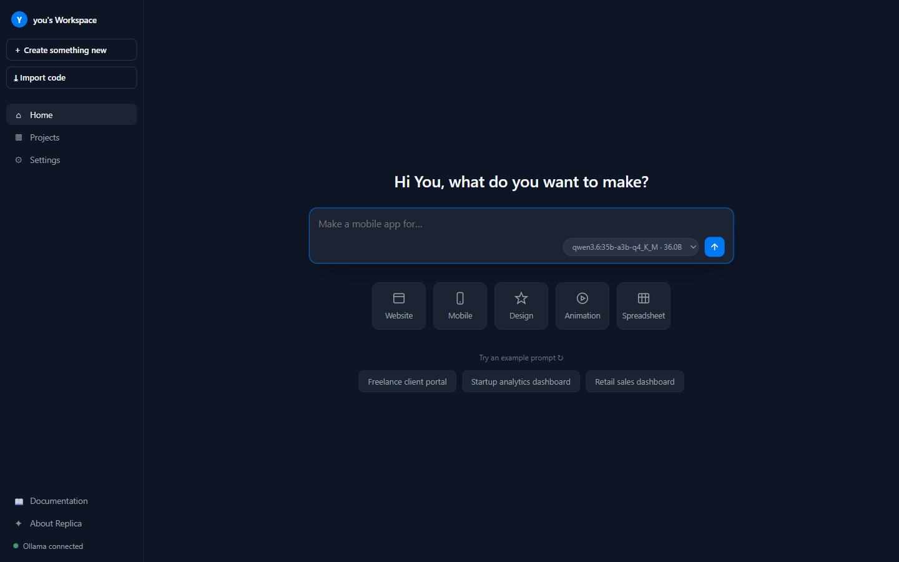
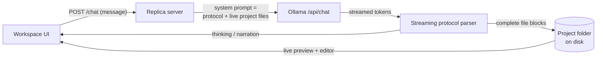

# Replica

**A fully local, zero-dependency Replit-style AI workspace.** Describe an app in plain
English. An agent backed by your own [Ollama](https://ollama.com) models plans it, writes
real files to your disk, and serves it in a live preview, with a code editor and console
alongside. No accounts, no credits, no cloud, no telemetry.

[](https://github.com/21sean/replica/actions/workflows/ci.yml)
[](LICENSE)




## Highlights

- **A real agent loop.** The model streams its thinking, narrates a plan, then emits
  complete files that are written to disk *as they stream*. Watch the app assemble
  itself, then keep chatting to iterate: the agent sees the current state of every
  project file each turn, including your manual edits.
- **Zero npm dependencies.** The entire backend is plain Node.js (`http`, `fs`,
  `child_process`, built-in `fetch`). `git clone`, `node server.js`, done.
- **Checkpoints on every turn.** Before the agent touches a file, the previous
  version is snapshotted. A bad generation is one click away from undone:
  restore any checkpoint from the chat.
- **Everything on your machine.** Projects are plain folders you can open in any
  editor. Generated apps use no CDNs and no external calls; pull the network cable and
  everything still runs.
- **Full workspace UI.** Live preview, file-tree code editor (Ctrl+S saves), and a
  console for running `node` / `python` scripts inside the project.
- **Real server apps, not just static sites.** Press Run and Replica starts your
  project's dev server on a free port, streams its logs to the console, and
  proxies the preview to it, Node and Python backends included.
- **Marketing page included.** A landing page at `/` describing the product, minus
  every sales artifact (no pricing, plans, credits, or upsells anywhere).

## Quickstart

Requirements: **Node 18+** and **Ollama** running locally with at least one chat model.

```bash
ollama pull qwen3.6:35b-a3b-q4_K_M   # or any chat model you like
git clone https://github.com/21sean/replica.git
cd replica
node server.js
```

| URL | What |
|---|---|
| `http://127.0.0.1:4747/` | Marketing page |
| `http://127.0.0.1:4747/agent` | Agent workspace |

Open the workspace, describe what you want to make, and watch it happen. The first
message after Ollama has been idle takes longer while the model loads into memory.



## How it works



The agent follows a strict output protocol: file writes stream as
`<<<FILE: path>>> … <<<END FILE>>>` blocks, parsed incrementally with chunk-boundary
hold-back so files land on disk the moment each block completes. Chat history is
compacted (narration plus a record of file operations), and the full current file
contents are rebuilt into the system prompt every turn, so the model always works
against the truth on disk rather than a stale transcript.

Details, diagrams, and design decisions: **[docs/ARCHITECTURE.md](docs/ARCHITECTURE.md)**.
HTTP reference: **[docs/API.md](docs/API.md)**.

## Configuration

Everything is environment-driven (see [`lib/config.js`](lib/config.js)):

| Variable | Default | Purpose |
|---|---|---|
| `HOST` | `127.0.0.1` | Bind address. Loopback by default; set `0.0.0.0` to expose on your LAN. |
| `PORT` | `4747` | HTTP port. |
| `OLLAMA_HOST` | `http://localhost:11434` | Ollama base URL. |
| `REPLICA_PROJECTS_DIR` | `./projects` | Where generated projects live. |
| `REPLICA_TEMPERATURE` | `0.4` | Sampling temperature for the agent. |
| `REPLICA_NUM_CTX` | `32768` | Context window requested from Ollama. |
| `REPLICA_CTX_RESERVE` | `1024` | Tokens reserved for the model's reply when trimming history to fit the window. |
| `REPLICA_KEEP_ALIVE` | `20m` | How long Ollama keeps the model loaded. |
| `REPLICA_EXEC_TIMEOUT` | `60000` | Console command timeout (ms). |
| `REPLICA_LOG_LEVEL` | `info` | `debug`, `info`, `warn`, `error` |

## Development

```bash
npm run dev    # auto-restarting server (node --watch)
npm test       # unit + integration suite (node:test, no test deps either)
```

The integration tests boot the full app against a mocked Ollama and verify a complete
agent turn end to end: streamed events, files written to disk, history persisted,
preview served. CI runs the suite on Linux, Windows, and macOS.

## Project layout

```
replica/
├── server.js          entry point: boot, bind, graceful shutdown
├── lib/
│   ├── config.js      environment-driven configuration
│   ├── app.js         HTTP app factory: routing, static, previews
│   ├── routes.js      JSON API + streaming chat endpoint
│   ├── agent.js       protocol prompt, context builder, streaming parsers
│   ├── ollama.js      Ollama client (models, chat stream)
│   ├── store.js       project store (plain folders + .replica/ state)
│   ├── security.js    path safety, command allowlist
│   ├── httpx.js       request/response helpers, MIME
│   └── log.js         leveled logger
├── public/            marketing page + workspace frontend (vanilla JS)
├── test/              node:test suite
└── projects/          your generated projects (gitignored)
```

## Security model

Replica is a personal localhost tool, not a multi-tenant service. See
[SECURITY.md](SECURITY.md) for the full threat model. Highlights: binds to loopback by
default, all file paths are traversal-checked, console commands are allowlisted to
local runtimes, and previews render in a sandboxed iframe.

## License

[MIT](LICENSE)
