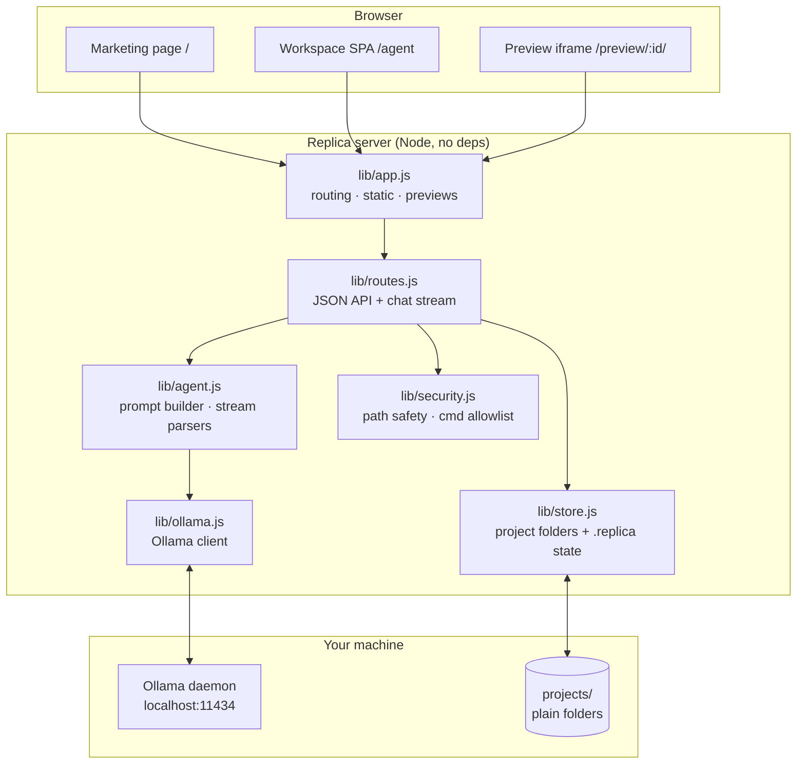
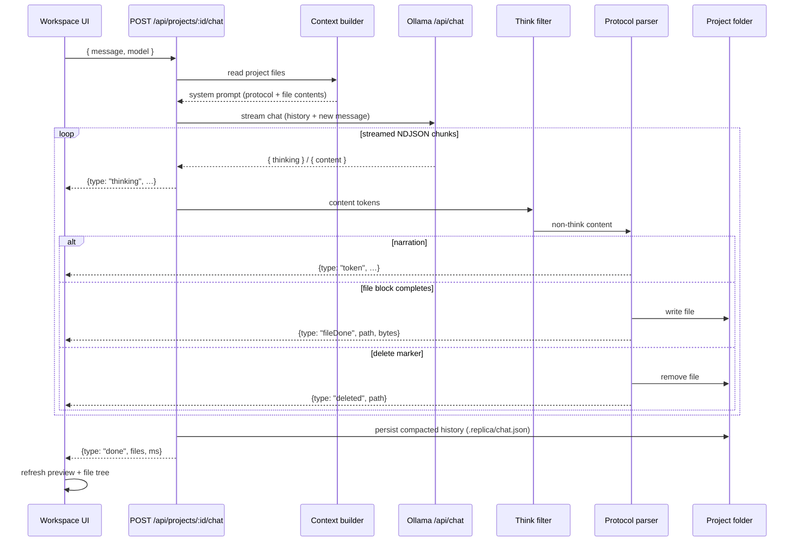

# Architecture

Replica is deliberately small: a zero-dependency Node.js server, a vanilla-JS
frontend, and the Ollama HTTP API. This document describes the pieces, the agent
streaming pipeline, and the design decisions behind them.

## System overview



**Module map**

| Module | Responsibility |
|---|---|
| `server.js` | Boot, bind (loopback by default), graceful shutdown, crash logging |
| `lib/app.js` | `createApp()` factory: request routing, static assets, preview serving, request logs |
| `lib/routes.js` | JSON API; the streaming `/chat` endpoint that orchestrates an agent turn |
| `lib/agent.js` | The protocol prompt, per-turn system prompt (embeds live file contents), and two streaming parsers |
| `lib/ollama.js` | Thin client: model listing, health, NDJSON chat stream as an async generator |
| `lib/store.js` | Projects as plain directories; metadata + chat history under `.replica/` |
| `lib/security.js` | `safeJoin` traversal guard; console command allowlist |
| `lib/httpx.js`, `lib/log.js` | Request/response helpers, MIME table, leveled logging |

## An agent turn, end to end



### The output protocol

The model is instructed to emit file operations in plain markers, never fenced:

```
<<<FILE: relative/path.ext>>>
(complete file contents)
<<<END FILE>>>

<<<DELETE: relative/path.ext>>>
```

Two streaming parsers process the token stream:

1. **Think filter** (`createThinkFilter`) — some models inline
   `<think>…</think>` spans instead of (or in addition to) Ollama's dedicated
   thinking channel. The filter splits those out so reasoning never leaks into
   narration or files.
2. **Protocol parser** (`createAgentParser`) — a small state machine over an
   accumulating buffer. Outside a file block it looks for `FILE`/`DELETE`
   markers; inside one it looks for the end marker.

**Chunk-boundary hold-back.** Tokens arrive in arbitrary slices, so a marker can
be split across chunks (`<<<FI` + `LE: x>>>`). The parser only flushes text when
it is provably not the beginning of a marker, holding back a small tail
(marker-length + margin) until more input arrives. The same reasoning applies to
the newline *after* a file marker: the marker regex must not consume it (it may
not have arrived yet), so a single leading newline is stripped at emit time
instead. The test suite feeds the parser one character at a time to lock this
behavior in.

**Truncation flagging.** If the stream ends mid-file (context exhausted, model
stopped, user aborted), the partial file is still written but flagged
`truncated: true`, the UI shows ⚠, and the persisted history records it so the
model knows to rewrite that file next turn.

### Context strategy

Rather than replaying an ever-growing transcript, each turn rebuilds reality
from disk:

- **System prompt** = protocol + project name/brief + *the current contents of
  every text file* (per-file and total caps keep it bounded).
- **History** is compacted before persisting: the assistant's narration is kept,
  but file bodies are replaced with one-line records like
  `(wrote index.html, 5132 chars)`. File contents would be stale the moment the
  user edits anything; the system prompt already carries the truth.
- **History is trimmed to the window.** Before each turn, `fitMessages` budgets
  the request against `REPLICA_NUM_CTX` (minus a reply reserve) using a
  chars/4 token estimate and drops the oldest turns first, inserting a short
  "N earlier messages omitted" note so the model knows the transcript is
  elided. Old turns are the cheapest thing to lose: the system prompt already
  contains the current state of every file.

This makes manual edits first-class: change a file in the Code tab (or in VS
Code directly) and the agent's next turn sees exactly what's on disk.

## Data layout

```
projects/
└── pomodoro-timer-3f2a/          ← one plain folder per project
    ├── index.html                ← the project itself, nothing else mixed in
    ├── style.css
    ├── script.js
    └── .replica/                 ← Replica-internal state (skipped in listings)
        ├── meta.json             {id, name, description, createdAt, updatedAt, model}
        └── chat.json             [{role, content, at}, …] (compacted)
```

Projects are the unit of everything: previews serve from the folder root, the
console runs with it as cwd, deletion is `rm -rf` of the folder, and backup is
"copy the folder".

## Design decisions

- **Zero dependencies, on purpose.** The target audience runs this next to a
  20 GB model file; a 200 MB `node_modules` for an HTTP server is absurd. Node's
  standard library covers everything needed, including `fetch` and the test
  runner. It also means no supply-chain surface and no install step.
- **NDJSON over WebSockets/SSE.** The chat stream is a plain chunked HTTP
  response of JSON lines. `fetch` + `ReadableStream` consumes it in ~15 lines of
  client code, it proxies cleanly, and there's no connection state to manage.
- **Files written mid-stream.** Writing each file the moment its block completes
  (rather than at end of turn) gives the live "app assembling itself" preview
  and means an aborted turn still leaves useful work on disk.
- **Vanilla-JS frontend.** ~1,300 lines total across three views. A framework
  would double the repo size for no functional gain at this scale.
- **Loopback binding by default.** Exposing an agent that writes files and runs
  commands should be a deliberate act (`HOST=0.0.0.0`), not a default.

## Failure modes and handling

| Failure | Behavior |
|---|---|
| Ollama down | `/api/health` reports it; UI shows a red status dot; chat returns a structured error event |
| Model stops mid-file | File written with `truncated` flag; ⚠ in UI; recorded in history for the next turn |
| Client disconnects mid-turn | Server aborts the Ollama request; partial narration/files persisted with `(interrupted)` marker |
| Malformed model output | Non-protocol text is just narration; stray fences around file bodies are stripped; unparseable NDJSON lines are skipped |
| Unsafe file path from model | Rejected by `safeJoin`, surfaced as an error event, turn continues |
